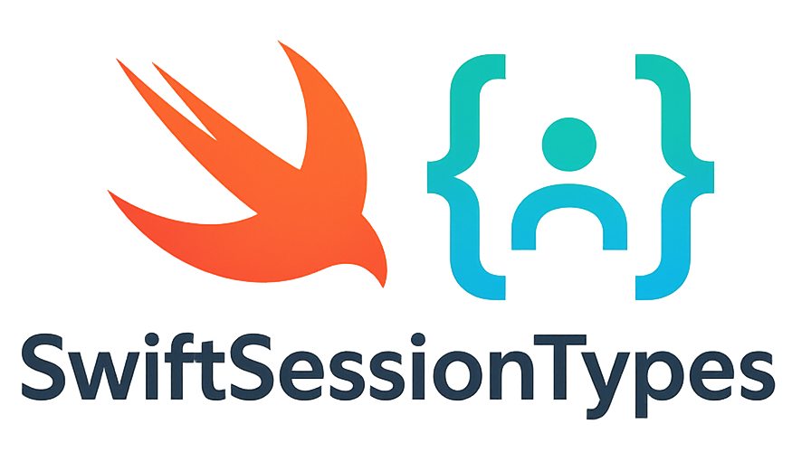

[](./LICENSE)

## Overview

SwiftSessionTypes is a session type package designed for Swift 6.0. This package was developed by three UNC Chapel Hill computer science students (Jacob Brown, Noah Frahm, and Alec Nipp) as our final project for UNC's COMP 730 course. This package was developed from a fork of an existing Swift session type library, *SwiftSessions* [*SwiftSessions*](https://github.com/alessiorubicini/SwiftSessions), Developed by Alessio Rubicini. 

SwiftSessionTypes expands upon the functionality and usability offered in by SwiftSessions using features recently introduced to the Swift community such as non copyable generics, semantics that more closely replicate session types in other languages such as Rust, and the migration of the packages unit testing suite from XCTest to Swift Testing. 

## Usage

Several toy examples have been included in the [Examples](Sources/Examples) folder. 

The package provides interfaces for defining binary session types in a protocol-like manner, and implementing these session types for IPC. The package provides an interface for the following operations 

- send 
- receive 
- offer (await a branching decision by the dual of the current implementation) 
- choose (make a branching decision)

### Step 1

Below we define an example session type where an string is sent, and then either a string is sent back, or the channel is closed.

```
enum ExampleProtocol {
    typealias proto = 
    Send<Int, 
        Offer<
            Recv<Int, Close>, 
            Close
        >
    >
}
```

### Step 2

After creating our protocol, we can then create the function that will implement it. To implement a session type, we define a @Sendable function that accepts two arguments. The first argument is the session type that we previously defined. The second argument will need to have the type `Session.Type`. This function will also need to be asynchronous because it yields on every session type operation and waits for the Dual implementation (which we will show next) to execute the opposite operation.

```
@Sendable func exampleImplementation(_ endpoint: consuming ExampleProtocol.proto,
                                     _ session: Session.Type) async
{
    let offerEndpoint = await session.send("Hello", on: endpoint)
    let choice = await session.offer(offerEndpoint)
    
    switch consume choice {
    case .left(let responseEndpoint):
        let response = await session.recv(from: responseEndpoint)
        print("Primary implementation received: \(response.getValue())")
        session.close(response.getEndpoint())
        
    case .right(let end):
        session.close(end)
    }
}
```

### Step 3

For every protocol we define, SwiftSessionTypes can also generate the dual (opposite) of that protocol to be implemented as well. To implement the Dual, we follow a process very similar to step 3. We will need to define an asynchronous, @Sendable, function that accepts two parameters. The first parameter will be of the Dual type of our protocol (i.e ExampleProtocol.proto.Dual in our example), as well as a second argument with the type of DualSession.Type.

```
@Sendable func exampleImplementationDual(_ endpoint: consuming ExampleProtocol.proto.Dual,
                                         _ session: DualSession.Type) async
{
    let messageCoupling = await session.recv(from: endpoint)
    
    print("Dual implementation received message: \(messageCoupling.getValue())")
    let responseEndpoint = await session.left(messageCoupling.getEndpoint())
    
    let end = await session.send("world", on: responseEndpoint)
    
    session.close(end)
}
```

### Step 4 

Now that we have defined our session type, it's primary implementation, and it's dual implemenation, we need to make a call to create the session and run our implementations. To do this, we use the 'Session.create(...) method. See the following example:

```
await Session.create(exampleImplementation, exampleImplementationDual)
```

Where the two arguments to the `.create()` method are the names of our two implementatation functions from the previous steps. Now we can click run and our example should print some text from the interaction to the console!

### Futher examples 

The [Examples](Source/Examples) folder has two other example usages of this package (a mock ATM and a mock FTP example) to further illustrate its usage. 

# Design Decisions

### usage of non copyable generics
Swift 6.0 featured the release of non copyable generic types. SwiftSessionTypes utilizes non copyable generics to ensure the *linearity* property provided by session types. That is, every endpoint can only be used (consumed) a single time. 

### `Session` vs. `DualSession`
This package uses the classes `Session` and `DualSession` to implement the binary operations provided by session types from the perspective of the primary and dual implementation respectively. The only differences between these two classes is that the return types of some of their methods have "flipped" generics. This is an abstraction that we recognize as potentially making usage confusing to the user. Please check the future work section to see how this could be improved in the future as Swift expands the functionality of non copyable types.

# Future Work

### Potential Improvements to Dual Generation
[Swift evolution proposal SE-0427](https://github.com/swiftlang/swift-evolution/blob/main/proposals/0427-noncopyable-generics.md) Introduced non-copyable types and several ways that they can be used. One area where this proposal falls short is in allowing associated types to suppress their copyable conformance. For example, the following code snippet:

```
public protocol SessionEndpoint: ~Copyable {
    associatedtype Dual: ~Copyable
}
```

produces the error `Cannot suppress 'Copyable' requirement of an associated type`. Expanding the functionality of non copyable types such that associated types could supress copyable conformance would allow for improved usability throughout this package by enabling recursive dual generation and checking.

### Configurable Underlying Channels 

Because the package already heavily relies on asynchronous programming, the underlying communication channel could be changed to be configurable at run time. an implemenation could allow these channels to communicate for uses outside of IPC using various networking protocols. 

Additionally, a synchronous version of this package could be useful and would have better performance for some uses than the current async focused implementation. 
